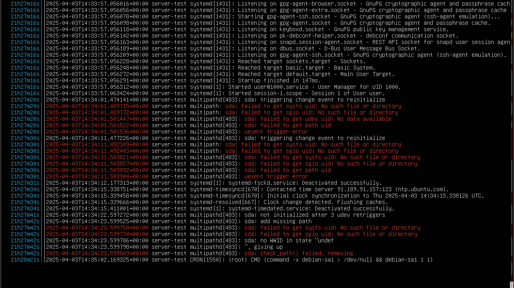

```
Задача находится на этапе доработки, необходимо конкретизировать условие, добавить больше примеров
```

# Задание - Анализ логов
В этом задании студенту предлагается написать bash-скрипт, который будет анализировать файл `/var/log/syslog` на наличие сообщений об ошибках и предупреждений.

## Собираем нужный Bash-скрипт

Создать файл можно командой `touch <имя файла>`, либо открыть еще не существующий файл, например, с использованием редактора nano: `nano <имя файла>` и сохранить его при помощи сочетания клавиш `crtl + O`

---

Далее не стоит забывать про права доступа скрипта. Для изменения прав доступа к файлу или директории используется консольная программа `chmod`. Например, при помощи `chmod +x <имя файла>`, можно дать права на выполнение данного файла. При этом, если отобразить список всех файлов командой `ls -l` до и после изменения, то можно наглядно наблюдать изменения в графе, показывающей биты маски прав.

Результат выполнения `chmod +x` выглядит примерно так, в сравнении с только что созданным файлом:


Видно, что теперь в маску добавились символы `x`, которые показывают права на выполнение любым пользователем и группой.


---

Аргументы командной строки в bash-скриптах - одна из важнейших функций. В коде обращаться к ним можно при помощи выражений `$0`, `$1`, `$2` и т.д 

Работать с опциями (позиционными параметрами) скрипта можно при помощи команды `getops`.

---

## Часть 1 - Базовый анализатор

Скрипт `log_analyzer.sh` принимает на вход единственный аргумент - файл для анализа (формат должен соответствовать `syslog`). Необходимо подсчитать количество соответствующих сообщений и вывести их в следующем формате:

```
TOTAL: [число]
ERROR: [число]
WARNING: [число]
```

Пример `/var/log/syslog`:


В качестве индикаторов ошибок/предупреждений будем использовать следующие паттерны:
- `error`, `fail`, `critical`, `segfault` для ошибок
- `warning`, `deprecat` (улавливает "deprecated"), `notice` для предупреждений

**Искать строки, содержащие в себе опреледенные паттерны можно командой `grep`. При этом, рекомендуется использовать расширенные регулярные выражения для упрощения кода и во избежание дублирования выводов**

**Подсчет строк, найденных grep можно осуществлять командой `wc -l`**

Если файл из аргумента не существует - вывести `ERROR: File [путь] not found` и завершить скрипт с кодом 1.

Если нет аргументов - вывести `USAGE: log_analyzer.sh [log_file]` и завершить скрипт с кодом 1.

>Пример тестов для данного этапа
>Для проверки при корректной работе
> `./log_analyzer.sh /var/log/syslog | grep -P '^(TOTAL|ERROR|WARNING): \d+$' | wc -l`
> 
> Для проверки при не существующем файле
> `./log_analyzer.sh /nonexistent 2>&1 | grep -q "ERROR: File /nonexistent not found"`

## Часть 2 - Фильтры, выходные файлы

В этой части нужно дополнить старый скрипт фильтрацией и сохранением результатов в файл, написав новый - `log_analyzerV2.sh`.

Теперь в функционал скрипта добавляются параметры (пользователь может вводить их в любом порядке):

- `-o` — выходной файл (по умолчанию `critical_events.log`)
- `-p` — паттерн поиска (по умолчанию паттерн такой, как в первой версии)

Выходной файл должен содержать строки из входного файла, которые соответствуют паттерну поиска. При успехе выводится две строки:

```
SAVED: [число записей]
FILE: [полный путь к файлу]
```

Выходной файл должен содержать только строки, соответствующие паттерну. Если записей нет — создавать пустой файл. При неверных параметрах выводить сообщение об ошибке и завершаться с кодом 1.


